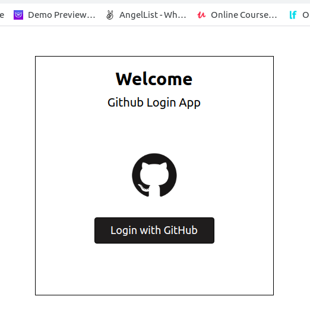
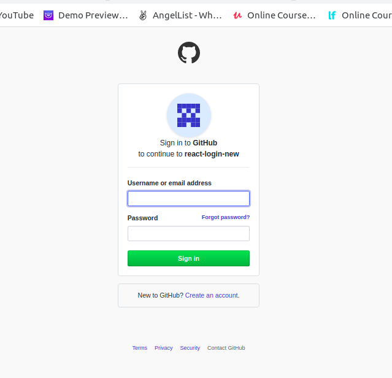
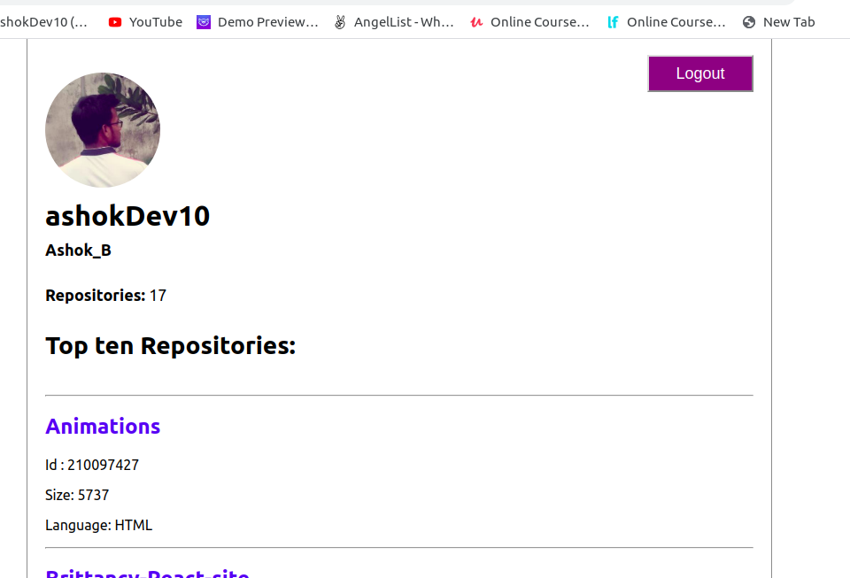
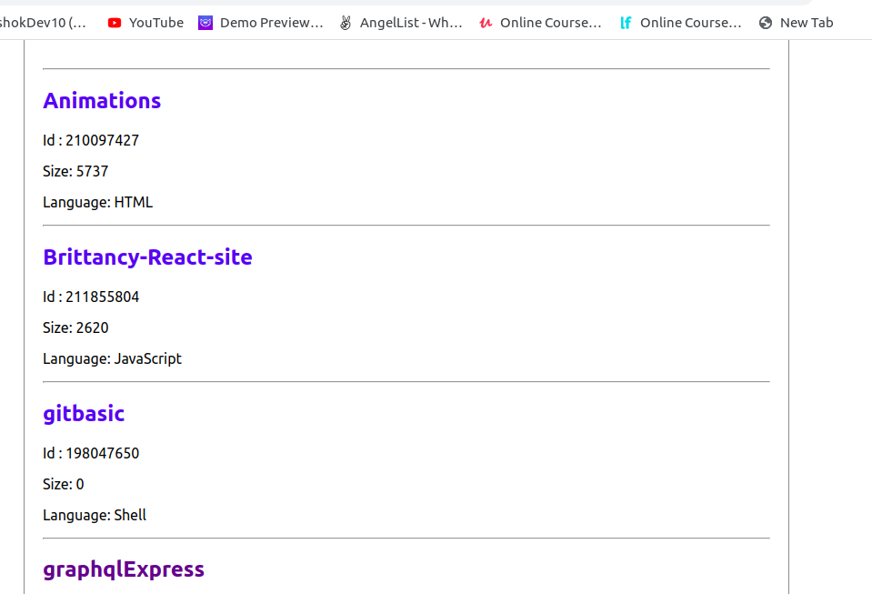

## Github login using oauth in React

### Usage and Installation Setup

- Clone this repo. Go to the root folder and run _yarn_ to install the dependencies.

- Login to your Github account and create an OAuth app by following the steps provided here (https://developer.github.com/apps/building-oauth-apps/creating-an-oauth-app/). Note: For this example, while creating the OAuth app, you can set your Homepage URL to http://localhost:3000/ and Authorization callback URL to http://localhost:3000/login if you are running your app locally.

- Set these variables using your's _Client ID_ and _Client Secret_ in **.env** file:
  ```
  REACT_APP_CLIENT_ID=Your Client ID
  REACT_APP_CLIENT_SECRET=Your Client Secret
  REACT_APP_REDIRECT_URI=http://localhost:3000/login
  REACT_APP_PROXY_URL=http://localhost:5000/authenticate
  SERVER_PORT=5000
  ```
- Install nodemon:

```
yarn add nodemon
```

- After setted of .env file, Don't forget to **Logout** your Github account in your device.

* After Gothub Logout in your device, Then run _yarn start_ to start the app

### Screenshots of application Flow:

Login:



Auth:


Home:


Home Repository:

